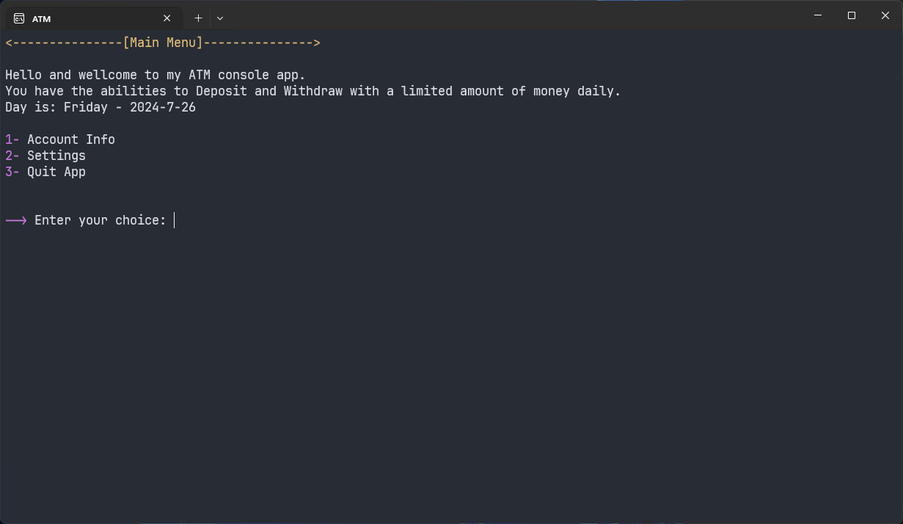
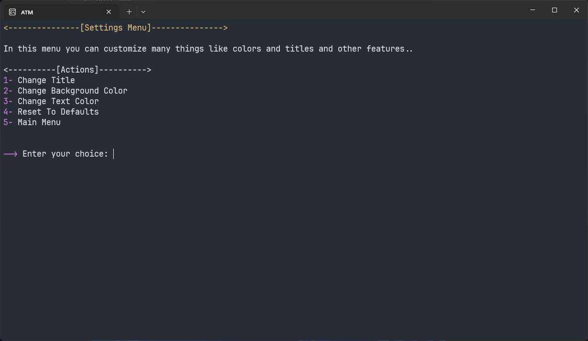
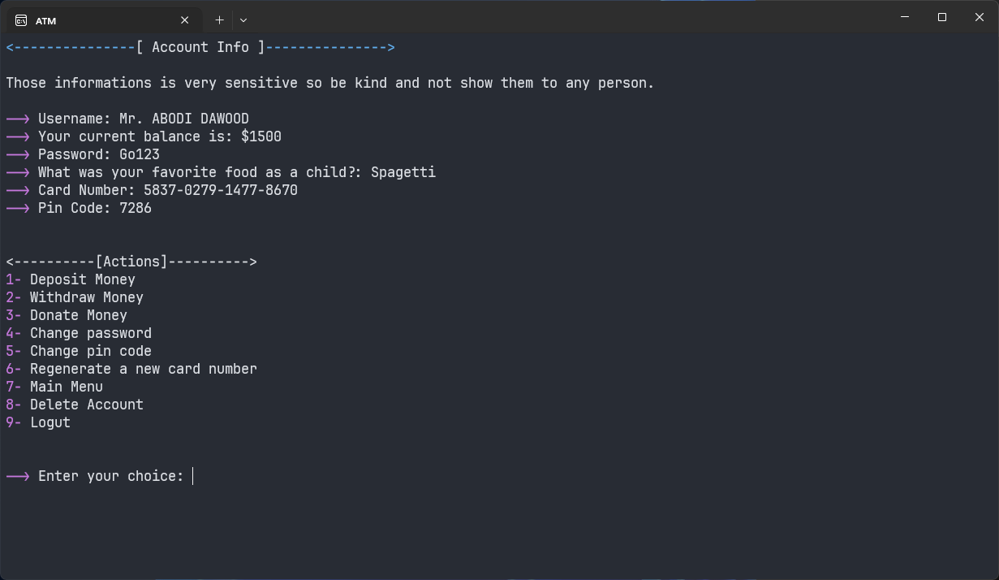
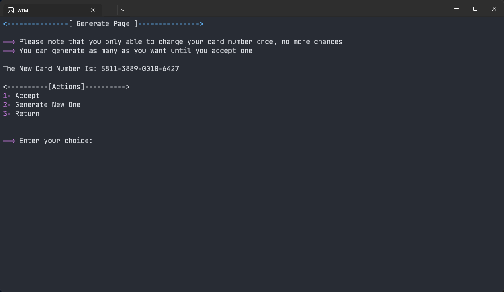

# ATM Project

## Description
The ATM Project is a console-based application written in C#. It was developed as a learning exercise while I was a beginner in C# programming. The application simulates basic ATM functionalities, allowing users to manage their bank accounts via the console.

## Features
- **Account Creation:** Users can create a new account by providing necessary details.
- **Deposit Money:** Users can deposit money into their account.
- **Withdraw Money:** Users can withdraw money from their account.
- **Donate Money:** Users can donate money from their account to others.
- **Account Information Panel:** Users can view their account information, including name, password, security question, card number, PIN code, and balance.
- **Account Management:** Users can regenerate a new card number, change their PIN code, change their password, delete their account, and log out.
- **Data Persistence:** All user data and changes are saved persistently using a `FileManager` class.

## User Interaction
Users interact with the application through the console by entering specific action numbers. The following actions are available:
- **Create Account:** Set up a new account.
- **Deposit Money:** Add funds to the account.
- **Withdraw Money:** Remove funds from the account.
- **Donate Money:** Transfer funds to another account.
- **View Account Information:** Display the user's account details.
- **Regenerate Card Number:** Generate a new card number for the account.
- **Change PIN Code:** Update the account's PIN code.
- **Change Password:** Update the account's password.
- **Delete Account:** Remove the user's account from the system.
- **Log Out:** Log out of the current session.

## Technologies Used
- **Programming Language:** C#
- **Environment:** Console Application

## Getting Started
To get started with the ATM Project, follow these steps:
1. Clone the repository to your local machine.
2. Open the solution file in Visual Studio.
3. Build and run the application.
4. Follow the on-screen instructions to create an account and start managing your funds.

## Screenshots

## Future Improvements
- Add a graphical user interface (GUI) for a better user experience.
- Implement additional security measures for account management.
- Enhance data persistence with a database backend.

## Contributing
If you would like to contribute to this project, please fork the repository and submit a pull request.

## License
This project is licensed under the MIT License.
